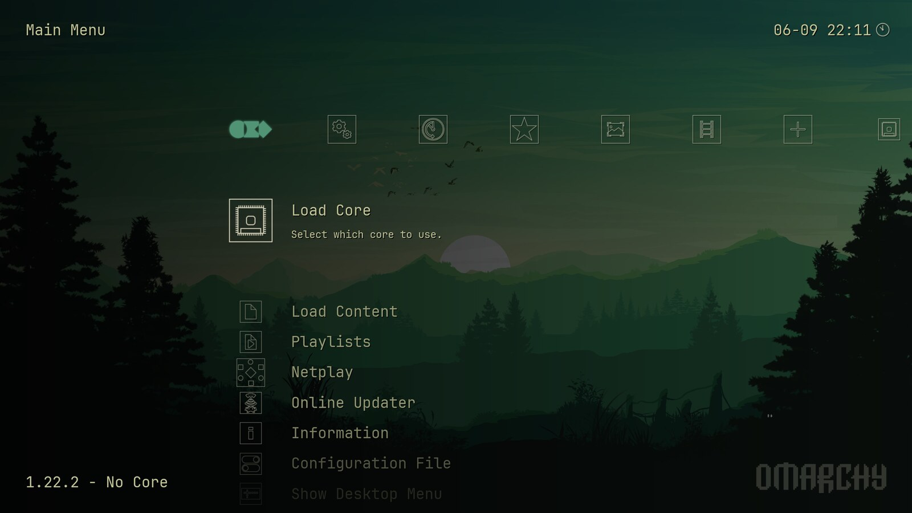
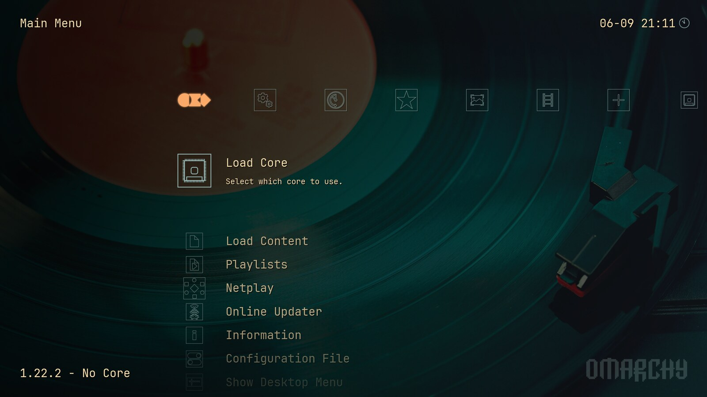
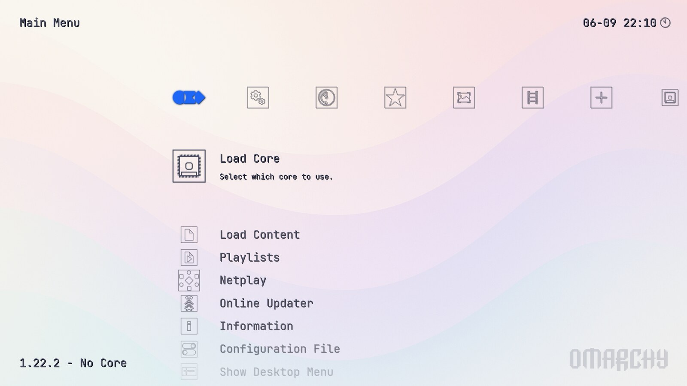
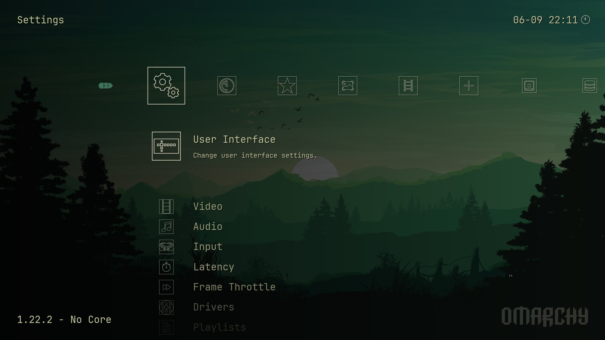

# omarchy-retroarch

RetroArch, dressed in your [Omarchy](https://omarchy.org) theme — and it keeps up when you change it.



RetroArch ships with a handful of built-in menu themes. None of them look like your
desktop. This generates one from whatever Omarchy theme you are actually running:
your wallpaper, your palette, your font, your logo.

Change your Omarchy theme and RetroArch follows, because it is wired into Omarchy's
own `theme-set` hook.

---

## It follows any theme

The same command, no manual work, three different Omarchy themes:

| Retro 82 | Catppuccin Latte |
|---|---|
|  |  |

Dark and light themes are handled differently — light themes get a light wash and
dark icons, dark themes get a dark scrim and light icons.



---

## Install

```bash
git clone https://github.com/hhammarstrand/omarchy-retroarch.git
cd omarchy-retroarch
./install.sh
omarchy-retroarch-theme
```

Then restart RetroArch.

That installs six commands into `~/.local/bin` and two hooks into
`~/.config/omarchy/hooks/`. Nothing is installed system-wide, and nothing needs root.

### Requirements

- Omarchy (uses its `omarchy-theme-color` palette resolver)
- RetroArch, launched at least once so it has written a `retroarch.cfg`
- The XMB assets — on Arch: `sudo pacman -S retroarch-assets-xmb`
- `imagemagick`, `python` and `fontconfig`

---

## Usage

```bash
omarchy-retroarch-theme                     # follow the current Omarchy theme
omarchy-retroarch-theme --theme nord        # preview another theme, desktop untouched
omarchy-retroarch-theme --force             # rebuild icons even if the tint is unchanged
omarchy-retroarch-theme --restore           # put RetroArch's own config back
```

Close RetroArch before running it. RetroArch rewrites its whole config when it exits,
so anything written underneath a running instance is lost. The command warns you if it
sees one running.

Options via environment:

| Variable | Default | Meaning |
|---|---|---|
| `OMARCHY_RETROARCH_ICONS` | `line` | `line` for hairline outlines, `solid` for filled glyphs |
| `OMARCHY_RETROARCH_SHADER` | `0` | XMB shader pipeline index — `0` none, `4` snow, `5` bokeh |
| `RETROARCH_CONFIG_DIR` | auto | override RetroArch config discovery |

---

## Building a library

The theme is one half. The other is turning a directory of ROMs into playlists
with real titles and cover art. Five commands do that, and each is safe to re-run:

```bash
retroarch-catalog ~/Roms      # scan a directory into RetroArch playlists
retroarch-titles              # replace filenames with database titles
retroarch-thumbnails          # fetch cover art from libretro's server
retroarch-placeholders        # draw themed covers for whatever has none
retroarch-optimize            # performance settings for a weak CPU
```

**`retroarch-catalog`** matches folder names to systems, picks a core for each, and
writes `.lpl` playlists. It skips save files, emulator binaries, PC programs and
audio rips, and keeps one entry per game when the same ROM exists as both a raw
file and an archive.

A game that crashes the core its system normally uses can be pinned to another
one in `~/.config/omarchy-retroarch/core-overrides.tsv` — `title prefix`, a tab,
then a core name. Those survive re-cataloguing:

```
Aero Blasters	mednafen_pce_fast
```

**`retroarch-titles`** is the interesting one. RetroArch ships ~145 databases in a
binary format (`RARCHDB` + MessagePack) with no command-line reader, so this
contains one. It matches by CRC32 first — the same checksum RetroArch computes —
then falls back to `rom_name` and to a normalised title. That fallback handles the
things real ROM collections are full of: catalogue numbers (`2581 - Sigma
Harmonics`), inverted articles (the database writes `American Tail, An`), roman
numerals (`alphamission2` against `Alpha Mission II`), and region variants of the
same title.

**`retroarch-thumbnails`** matches those titles against libretro's thumbnail
server, falling back from box art to title screens to snapshots, and searching the
FBNeo and MAME repositories for arcade playlists.

**`retroarch-placeholders`** draws a cover in the current Omarchy palette for
anything still without one — obscure Japanese releases and homebrew that was never
photographed. It is the difference between a complete-looking library and a grid
with holes in it.

**`retroarch-optimize`** turns off the shader chain, which on a CPU-limited machine
costs more than it looks: shader passes are draw calls, and draw calls are CPU. On
a Pentium G4400 with a GTX 1080 Ti this took Donkey Kong 64 from 100 to 164 fps.
`revert` puts it back; `crt` swaps in a 2-pass CRT filter instead of a 13-pass one.

---

## How it works

Everything is derived from the theme's `colors.toml`, resolved through Omarchy's own
`omarchy-theme-color`, so third-party themes that only define ANSI colours still work.

**Icons.** RetroArch's stock icon sets are white line art whose contrast comes from the
alpha channel, so they survive a flat recolour. All ~850 of them are copied and tinted
to the theme's foreground colour. The line-art set is laid over the monochrome set,
which is the only complete one, so the handful of platform logos it lacks still render.

**The main menu icon** is Omarchy's own logomark, tinted in the theme's accent colour.

**Background.** Your current desktop wallpaper, washed toward the theme's darkest
background colour, with a vertical falloff so the menu column keeps its contrast, and
a RETROMARCHY wordmark set into the corner at low opacity. Themes without a usable image
get a flat gradient in their own colours instead.

**Colours.** Menu font colours are written as exact RGB from the palette. XMB's
background gradients are compiled into RetroArch and cannot be set to arbitrary values,
so the closest one is picked by circular hue distance against the theme's accent — a
near-grey accent falls back to the neutral wash. RGUI is the one menu driver that
accepts arbitrary colours, so it gets an exact-hex palette file.

A theme is free to write its palette as `rgb()` or a named colour. Those still drive
the icons and the background, but RetroArch's own colour keys take integers only, so
they are left at their defaults rather than written as something malformed — the run
says so when it happens.

**Assets.** `assets_directory` is pointed at `~/.config/retroarch/assets-omarchy`, a
symlink farm over the packaged assets. You keep getting asset updates from your package
manager; we just own one extra icon set beside them. Real directories are never
replaced with symlinks, so anything RetroArch's own updater pulls in stays put.

**Hooks.** `~/.config/omarchy/hooks/theme-set.d/retroarch` and `font-set.d/retroarch`
re-run the command on every `omarchy theme set` and `omarchy font set`. Tinting is
cached against a stamp file, so a run that only changes the wallpaper or font takes a
few seconds instead of twenty.

---

## What it changes

The first run copies `retroarch.cfg` to `retroarch.cfg.pre-omarchy` before touching
anything. `--restore` puts that file back and deletes the generated assets. These are
the only settings written:

```
assets_directory              menu_wallpaper                menu_font_color_red
menu_driver = xmb             menu_wallpaper_opacity        menu_font_color_green
xmb_theme = 6 (custom icons)  menu_dynamic_wallpaper_enable menu_font_color_blue
xmb_menu_color_theme          xmb_font                      xmb_shadows_enable
xmb_alpha_factor              video_font_path               rgui_menu_color_theme
menu_shader_pipeline                                        rgui_menu_theme_preset
```

Your cores, playlists, saves, input binds and per-core settings are not touched.

---

## Uninstall

```bash
./uninstall.sh
```

Restores the pre-install config, removes the generated assets, and deletes the command
and both hooks.

---

## Known limitations

- **XMB only.** The theme is built for RetroArch's XMB driver, and the command sets
  `menu_driver = xmb`. Ozone and MaterialUI are not themed.
- **`omarchy theme bg next` does not fire a hook** in Omarchy, so cycling the desktop
  background does not reach RetroArch on its own. Re-run the command (a few seconds,
  the icons are cached) or wait for the next theme switch.
- **Don't run it while RetroArch is open** — see above.
- The first run tints ~850 icons and takes roughly 20 seconds.
- Developed and tested on Arch + Omarchy with a native RetroArch. The Flatpak config
  path is detected but untested.

---

## Licence

MIT — see [LICENSE](LICENSE).

RetroArch's XMB icon sets are the work of the [libretro](https://github.com/libretro/retroarch-assets)
project and are recoloured, not redistributed. The Omarchy logo belongs to
[Omarchy](https://omarchy.org).
